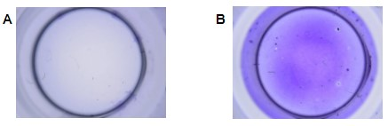

<h1 align="center">Análisis de imágenes usando el Biofilm Analyzer Software</h1>

<h2>Información sobre el experimento</h2>

Usted analizará los experimentos de formación y adherencia de biopelículas de la cepa <i>Pseudomona aeruginosa</i> realizados por el <a href="https://investigacion.cayetano.edu.pe/catalogo/biotecnologia/lmi" target="_blank" rel="noreferrer noopener">Laboratorio de Moléculas Individuales</a> en el año 2019. Esta experiencia consistió en el crecimiento de biopelícula durante diferentes tiempos de incubación. Los cultivos se realizaron en una placa de 96 pocillos. Luego, las biopelículas fueron teñidas usando el reactivo cristal violeta. La distribución de controles negativos y experimentos fue la siguiente:

- La columna 1 es el control negativo (medio de cultivo sin bacterias).
- De la columna 2 hasta la 8 tenemos los pocillos con medio de cultivo y bacteria a diferentes tiempos de incubación (4 a 28 horas). Las cuatro primeras filas (A,B,C y D) son réplicas. 
- Sólo se utilizaron 32 pocillos en total.

  

 Al finalizar, se tomaron fotografías de los pocillos con un microscopio digital 1000X CoolingTech, una lámpara LED de luz blanca y un filtro de acrílico blanco de 3mm. Estos son unos ejemplos de control negativo (A) y crecimiento de biopelícula (B).

  

<h2>Instrucciones para el análisis de imágenes</h2>

Su objetivo es obtener la cantidad de biopelícula adherida en cada uno de los 32 pocillos utilizando el Biofilm Analyzer Software (BAS). Para cumplir con este objetivo, debe seguir la siguiente lista de actividades:

### PASO 0: Instalación y ejecución del BAS
- Descargar el software desde [aquí](). La carpeta comprimida también contiene las imágenes que analizará en los siguientes pasos.
- Descomprimir la carpeta, acceder a ella, y dar doble clic en el archivo BAS.exe

### PASO 1: Importación de imágenes al BAS

En la seccion **Choose Work Space** podrá ubicar e importar las imágenes para el análisis:
- Dar clic en el boton gris con puntos suspensivos.
- Buscar en ruta específica la carpeta con las imágenes de los controles negativos y biopelículas. 
- Seleccionar en ruta específica la carpeta con imágenes y dar clic en **Seleccionar carpeta**. Las imágenes se cargarán automáticamente.
- Seleccionar la imagen de referencia (control negativo) en el recuadro superior y la imagen con biopelícula en el recuadro inferior.
- Utilizar las flechas al pie de los recuadros para ir hacia delante o atrás, hasta encontrar la imagen de interés.

> **IMPORTANTE:** Para la cuantificación de la imágenes de biopelícula de cada fila, debe utilizar el control negativo que le corresponde. Por ejemplo: Si analiza las imágenes de la Fila A, debe utilizar como imagen de referencia la imagen A1 y comparar con la imagen A2, A3,..., A8. Para la Fila B, la imagen de referencia es B1, y así para cada fila.

  

### PASO 2: Recorte de la región de interés de la imagen
- Seleccionar imágen para analizar
- Seleccionar los puntos extremos del fondo del pocillo

