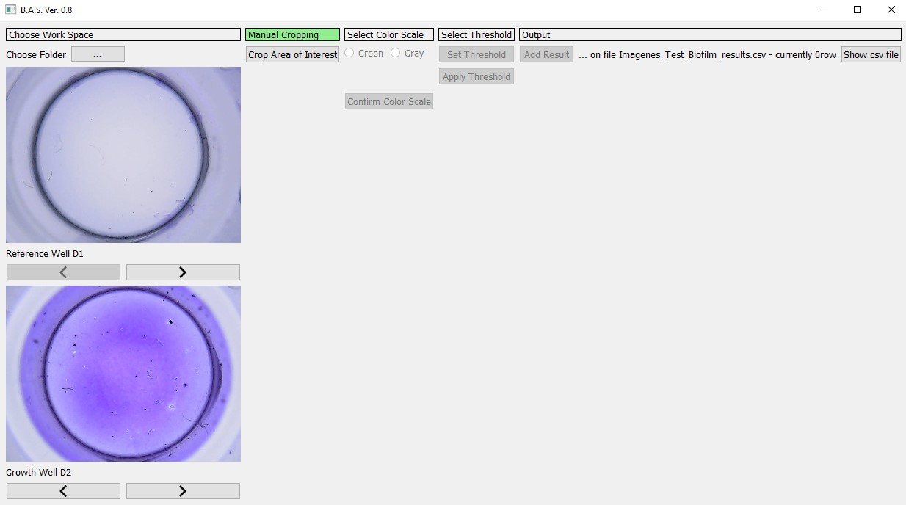
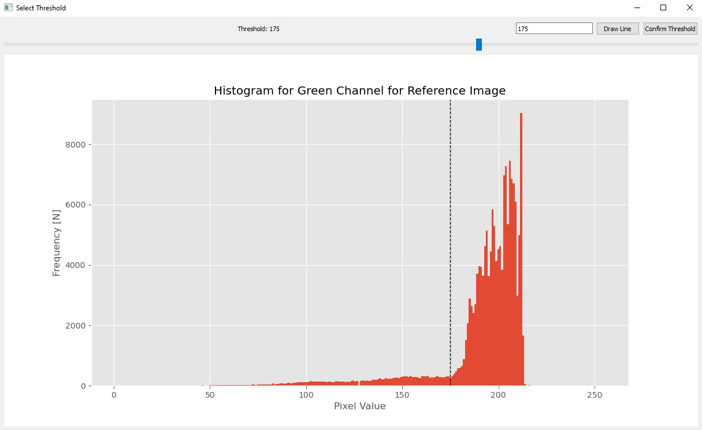

<h1 align="center">Análisis de imágenes usando el Biofilm Analyzer Software</h1>

<h2>Información sobre el experimento</h2>

Usted analizará los experimentos de formación y adherencia de biopelículas de la cepa <i>Pseudomona aeruginosa</i> realizados por el <a href="https://investigacion.cayetano.edu.pe/catalogo/biotecnologia/lmi" target="_blank" rel="noreferrer noopener">Laboratorio de Moléculas Individuales</a> en el año 2019. Esta experiencia consistió en el crecimiento de biopelícula durante diferentes tiempos de incubación. Los cultivos se realizaron en una placa de 96 pocillos. Luego, las biopelículas fueron teñidas usando el reactivo cristal violeta. La distribución de controles negativos y experimentos fue la siguiente:

- La columna 1 es el control negativo (medio de cultivo sin bacterias).
- De la columna 2 hasta la 8 tenemos los pocillos con medio de cultivo y bacteria a diferentes tiempos de incubación (4 a 28 horas). Las cuatro primeras filas (A,B,C y D) son réplicas. 
- Sólo se utilizaron 32 pocillos en total.

  

 Al finalizar, se tomaron fotografías de los pocillos con un microscopio digital 1000X CoolingTech, una lámpara LED de luz blanca y un filtro de acrílico blanco de 3mm. Estos son unos ejemplos de control negativo (A) y crecimiento de biopelícula (B).

  

<h2>Instrucciones para el análisis de imágenes</h2>

Su objetivo es obtener la cantidad de biopelícula adherida en cada uno de los 32 pocillos utilizando el Biofilm Analyzer Software (BAS). Para cumplir con este objetivo, debe seguir la siguiente lista de actividades:

### PASO 0: Instalación y ejecución del BAS
- Descargar el software desde [aquí](). La carpeta comprimida también contiene las imágenes que analizará en los siguientes pasos.
- Descomprimir la carpeta, acceder a ella, y dar doble clic en el archivo BAS.exe

### PASO 1: Importación de imágenes al BAS

En la sección **Choose Work Space** puede ubicar e importar las imágenes para el análisis:
- Dar clic en el boton gris con puntos suspensivos.
- Buscar en ruta específica la carpeta con las imágenes de los controles negativos y biopelículas. 
- Seleccionar en ruta específica la carpeta con imágenes y dar clic en **Seleccionar carpeta**. Las imágenes se cargarán automáticamente.
- Seleccionar la imagen de referencia (control negativo) en el recuadro superior y la imagen con biopelícula en el recuadro inferior.
- Utilizar las flechas al pie de los recuadros para ir hacia delante o atrás, hasta encontrar la imagen de interés.

> **IMPORTANTE:** Para la cuantificación de la imágenes de biopelícula de cada fila, debe utilizar el control negativo que le corresponde. Por ejemplo: si analiza las imágenes de la Fila A, debe utilizar como imagen de referencia la imagen A1 y comparar con la imagen A2, A3,..., A8. Para la Fila B, la imagen de referencia es B1, y así para cada fila.

  

### PASO 2: Recorte de la región de interés de la imagen

En la sección **Manual Cropping** puede recortar la imagen para analizar sólo el fondo del pocillo:
- Dar clic en **Crop Area of Interest**, aparecerá un recuadro con indicaciones sobre el proceso de segmentación, dar clic en **OK**.
- Dar clic en un extremo de la imagen, mantener presionado el botón izquierdo del ratón y arrastrar el puntero para seleccionar el área de interés para la segmentación. Presionar Enter para confirmar la selección.
- La primera imagen es el control negativo y la segunda imagen es la imagen con biopelícula.

> **NOTA:** Si no está conforme con la selección del área de interés, tiene dos formas de revertir la segmentación. La primera opción es no presionar Enter hasta que considere que la selección es adecuada. Puede repetir el proceso de selección varias veces dando clic en cualquier extremo de la imagen hasta obtener el área apropiada. Para finalizar, presionar Enter. La segunda opción es dando clic de nuevo en **Crop Area of Interest** para realizar de nuevo el proceso de segmentación.

  

### PASO 3: Selección de filtros

En la sección **Select Color Scale** puede seleccionar un filtro para facilitar la cuantificación de biopelícula:
- Elija un filtro entre la Escala de Grises o el Canal Verde, luedo dé clic en **Confirm Color Scale**.

> **IMPORTANTE:** Debe utilizar un sólo tipo de filtro para el análisis de toda una fila. Por ejemplo: si analiza las imágenes de la Fila A y elige el Canal Verde para analizar la imagen A2, entonces deberá utilizar el mismo filtro para el resto de imágenes de esa fila. También puede utilizar un sólo filtro para analizar las 32 imágenes. La selección del filtro dependerá del tipo de imagen a analizar. 

  

  

### PASO 4: Cuantificación

En la sección <b>Select Threshold</b> puede seleccionar el umbral que permitirá la cuantificación de biopelícula. En esta sección se analiza el Histograma de Frecuencia de Píxeles de la imagen de referencia. Los valores de píxel varían desde 0 hasta 255 (eje X). Los píxeles más oscuros serán de menor valor o se ubican más hacia la izquierda de la gráfica; mientras que, los píxeles más claros serán de mayor valor o se ubican más hacia la derecha. Usted debe definir un umbral que permitirá al software identificar qué píxeles representan biopelícula:

- Dar clic en **Set Threshold** y aparecerá una ventana emergente con el Histograma.
- Seleccionar el valor de umbral ya sea utilizando la barra deslizadora o ingresando un número entre 0 y 255 en el recuadro superior, luego dar clic en **Draw Line**.
- Dar clic en **Confirm Threshold** y, luego, en **Apply Threshold** para finalizar el proceso. El BAS mostrará automáticamente el resultado de la cuantificación.

> **NOTA:** BAS designa a los píxeles de la derecha del umbral como segmentos de fondo sin biopelícula, y a los píxeles de la izquierda como segmentos de biopelícula. Los píxeles en la izquierda de la gráfica también podrían representar la presencia de artefactos en la imagen. Esto puede suceder por la contaminación del control o la incorrecta adquisición de la imagen.

  

### PASO 5: Exportación de resultados

En la sección <b>Select Threshold</b> puede observar, guardar y exportar los resultados de la cuantificación de biopelícula. El BAS expresa la cantidad de biopelícula mediante el porcentaje de píxeles que representa la materia orgánica en la imagen analizada. En el ejemplo presentado, BAS ha calculado que casi el 100% de los píxeles representaría a la biopelícula. Si se observa la imagen original, efectivamente, todo el fondo del pocillo está teñido, lo que significa que la biopelícula cubrió toda el área de interés:

- Dar clic en **Add Result** para grabar y exportar el resultado en un archivo CSV, luego dar clic en **OK**. Este archivo se exportará automáticamente y se almacenará en la carpeta donde esta el archivo BAS.exe.
- Dar clic en **Show csv file** para visualizar el resultado en el mismo entorno del BAS.
- Dar clic en el ícono de Guardar si desea descargar la imagen con el resultado.
 
 > **NOTA:** Los datos que se generan en el archivo CSV corresponden a Estadística Descriptiva de la distribución de píxeles de la imagen de interés y la distribución de los píxeles que representan biopelícula.

  

### Encuesta de Usabilidad del BAS

Visitar este link, subir el archivo CSV generado por el software con los resultados del análisis y completar la Encuesta de Usabilidad.

