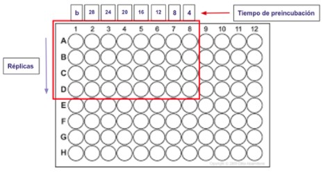

<h1 align="center">Análisis de imágenes usando el Biofilm Analyzer Software</h1>

<h2>Información sobre el experimento</h2>

Usted analizará los experimentos de formación y adherencia de biopelículas de la cepa Pseudomona aeruginosa realizados por el Laboratorio de Moléculas Individuales en el año 2019. Esta experiencia consistió en el crecimiento de biopelícula durante diferentes tiempos de incubación. Los cultivos se realizaron en una placa de 96 pocillos. Luego, las biopelículas fueron teñidas usando el reactivo cristal violeta. La distribución de controles negativos y experimentos fue la siguiente:

- La columna 1 es el control negativo (medio de cultivo sin bacterias).
- De la columna 2 hasta la 8 tenemos los pocillos con medio de cultivo y bacteria a diferentes tiempos de incubación (4 a 28 horas). Las cuatro primeras filas (A,B,C y D) son réplicas. 
- Sólo se utilizaron 32 pocillos en total.

  

 Al finalizar, se tomaron fotografías de los pocillos con un microscopio digital 1000X CoolingTech, una lámpara LED de luz blanca y un filtro de acrílico blanco de 3mm. Estos son unos ejemplos de control negativo (A) y crecimiento de biopelícula (B).

  

